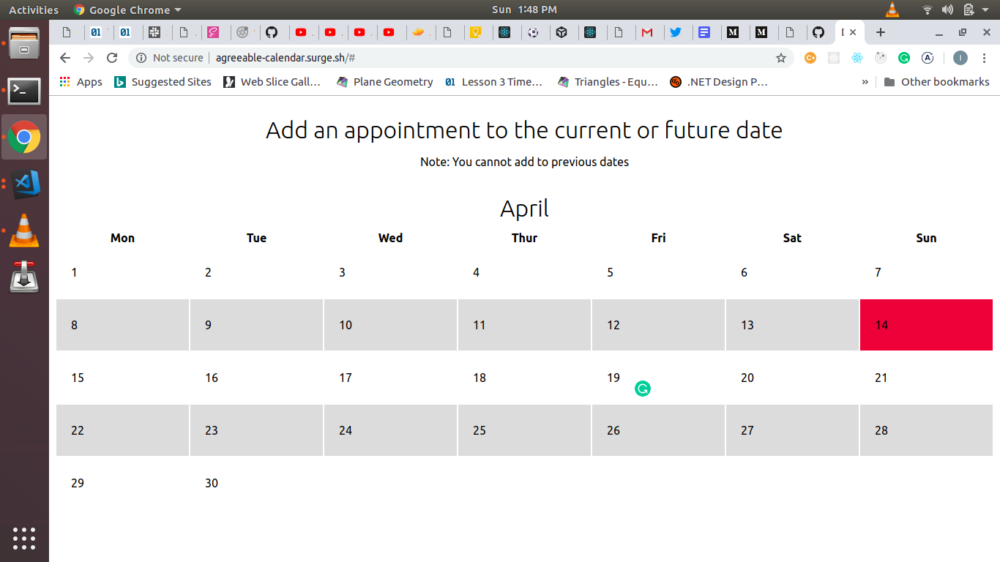
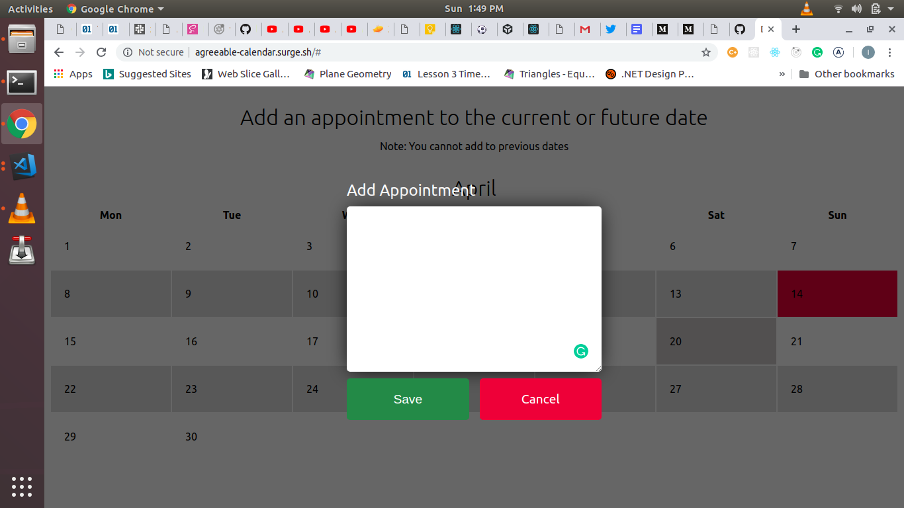
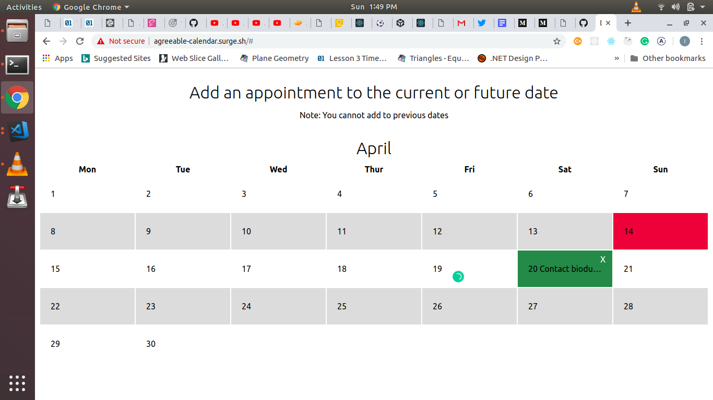

## Calendar Demo
Custom calendar using only VanillaJS, HTML and CSS - no library.

Here is what it looks like:

First screen:

Second screen:

Last screen:

Inspiration can be drawn from here to customize the code how you see fit.
